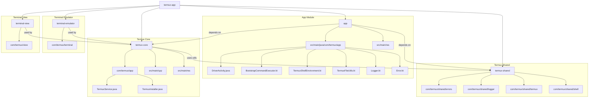

# Termux App Refactor Plan

## Overview

This document captures a high-level view of the project structure and identifies suitable leaf nodes for the initial Kotlin migration.

## Module Structure

## Leaf Nodes (Good First Migration Targets)

Start refactoring these files first; they have minimal inbound dependencies:

1. `app/src/main/java/com/termux/app/BootstrapCommandExecutor.kt`
2. `app/src/main/java/com/termux/app/TermuxShellEnvironment.kt`
3. `app/src/main/java/com/termux/app/TermuxFileUtils.kt`
4. `app/src/main/java/com/termux/app/Logger.kt`
5. `app/src/main/java/com/termux/app/Error.kt`
6. Utility classes under `termux-shared` used by a single module
7. Helper classes inside `termux-core` with limited cross-module usage

## Suggested Migration Flow

1. **Stabilize the build** (resolve file locks, update Gradle/Kotlin).
2. **Convert leaf nodes** to Kotlin and clean them up.
3. **Introduce Kotlin-first architecture** (ViewModels, coroutines/Flow).
4. **Gradually replace** `termux-core` dependencies with Kotlin equivalents if desired.
5. **Modernize UI/UX** (ViewBinding or Compose) and streamline async logic.
6. **Add tests & CI** to prevent regressions during the migration.

